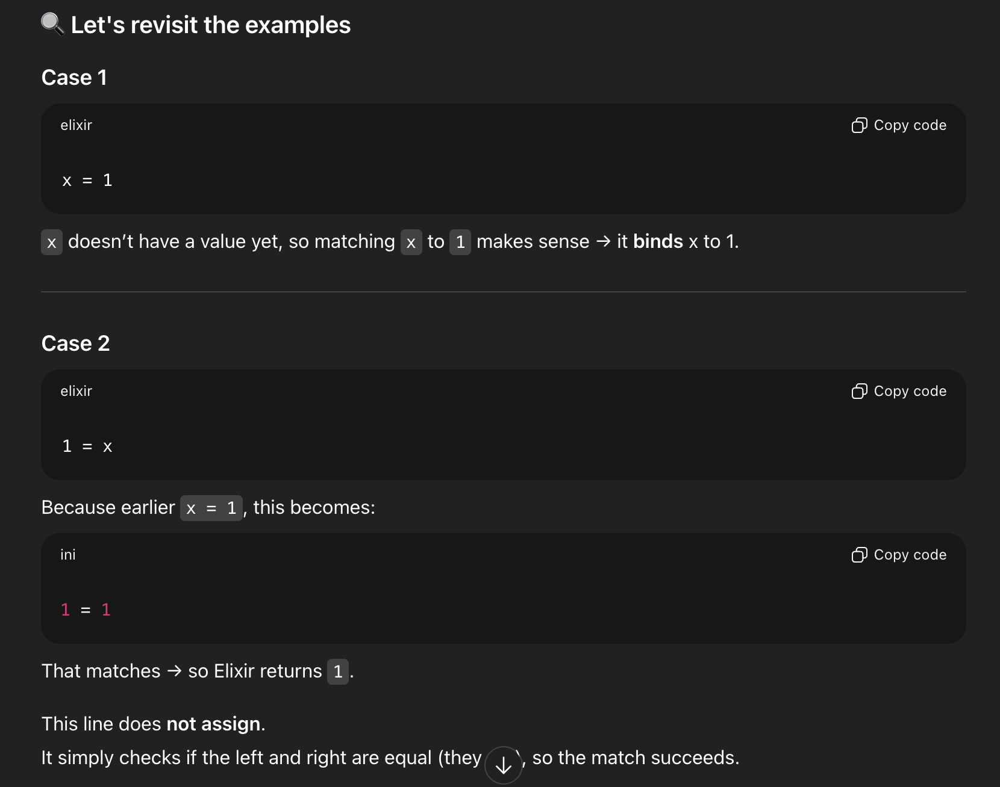

## Function arity
- Other languages distinguish functions by name and parameter types.
- Elixir distinguishes them by name + arity.
- You can have multiple definitions of foo in the same module — as long as they differ by arity.
- more on this in pattern matching section
## Tuples
- a list of values of any types
- stored contiguously so `O(1)` lookup and edit
- use `elem(tuple, index)` for lookup
- use `put_elem(tuple, index, value)` for edit
- use `tuple_size(tuple)` to get size
- tuples are immutable, so `put_elem` returns a new tuple
- IO.puts doesn't work directly on tuples, use `IO.inspect/1` instead
example: 
```elixir
tuple = { :ok, "hello" }
elem(tuple, 1)
tuple_size(tuple)
new_tuple = put_elem(tuple, 1, "new elem")
IO.inspect(new_tuple)
```
## (Linked) Lists
- a list of values of any types
- linked list implementation, so `O(n)` lookup and edit
- use pattern matching to get head and tail: `[head | tail] = list`
- use `length(list)` to get size
- use `hd(list)` to get head
- use `tl(list)` to get tail
- Two lists can be concatenated using the `++` operator and subtracted using the `--` operator.
- Elixir data structures are immutable, so operations return new lists
- Charlist:
  - When Elixir sees a list of printable ASCII numbers, Elixir will print that as a charlist
  - Whenever you see a value in IEx and you are not quite sure what it is, you can use i to retrieve information about it, example run `i ~c"hello"` in `iex`
- the performance of list concatenation depends on the length of the left-hand list:
  - `left ++ right` takes time proportional to the length of `left`
  - `right ++ left` takes time proportional to the length of `right`

## Tuples or Lists
- Lists are stored in memory as linked lists, meaning that each element in a list holds its value and points to the following element until the end of the list is reached. This means accessing the length of a list is a linear operation: we need to traverse the whole list in order to figure out its size.
- Tuples, on the other hand, are stored contiguously in memory. This means getting the tuple size or accessing an element by index is fast. On the other hand, updating or adding elements to tuples is expensive because it requires creating a new tuple in memory:
- Note, however, the elements themselves are not copied. When you update a tuple, all entries are shared between the old and the new tuple, except for the entry that has been replaced. This rule applies to most data structures in Elixir. This reduces the amount of memory allocation the language needs to perform and is only possible thanks to the immutable semantics of the language.

- Those performance characteristics dictate the usage of those data structures. In a nutshell, lists are used when the number of elements returned may vary. Tuples have a fixed size. Let's see two examples from the String module:

```elixir
String.split("hello world")
["hello", "world"]
String.split("hello beautiful world")
["hello", "beautiful", "world"]
```
- The String.split function breaks a string into a list of strings on every whitespace character. Since the amount of elements returned depends on the input, we use a list.

- On the other hand, String.split_at splits a string in two parts at a given position. Since it always returns two entries, regardless of the input size, it returns tuples:
```elixir
String.split_at("hello world", 3)
{"hel", "lo world"}
String.split_at("hello world", -4)
{"hello w", "orld"}
```
- It is also very common to use tuples and atoms to create "tagged tuples", which is a handy return value when an operation may succeed or fail. For example, File.read reads the contents of a file at a given path, which may or may not exist. It returns tagged tuples:

```elixir
File.read("path/to/existing/file")
{:ok, "... contents ..."}
File.read("path/to/unknown/file")
{:error, :enoent}
```

- Given Elixir consistently follows those rules, the choice between lists and tuples get clearer as you learn and use the language. Elixir often guides you to do the right thing. For example, there is an elem function to access a tuple item, However, given you often don't know the number of elements in a list, there is no built-in equivalent for accessing arbitrary entries in a lists, apart from its head.

## Size or length?
When counting the elements in a data structure, Elixir also abides by a simple rule: the function is named size if the operation is in constant time (the value is pre-calculated) or length if the operation is linear (calculating the length gets slower as the input grows). As a mnemonic, both "length" and "linear" start with "l".

- For example, we have used 4 counting functions so far: byte_size (for the number of bytes in a string), tuple_size (for tuple size), length (for list length) and String.length (for the number of graphemes in a string). We use byte_size to get the number of bytes in a string, which is a cheap operation. Retrieving the number of Unicode graphemes, on the other hand, uses String.length, and may be expensive as it relies on a traversal of the entire string.

## Pattern matching
- In this chapter, we will learn why the `=` operator in Elixir is called the match operator and how to use it to pattern match inside data structures. We will learn about the pin operator `^` used to access previously bound values.
- = operator means "Try to make the left side equal to the right side by matching (unifying) them"
- `LEFT PATTERN = RIGHT VALUE`
    - If the pattern can match the value:

    - Variables in the pattern get bound as needed.

    - Matching succeeds.

    - If they cannot match:

    - MatchError is raised.


So a = b only binds a if necessary to make the pattern match.
- Pattern matching is a mechanism for checking a value against a pattern. It is used in variable assignment, function definitions, and control flow constructs.
- The left side of the `=` operator is the pattern, and the right side is the value to be matched.
- If the value matches the pattern, the variables in the pattern are bound to the corresponding values.
- If the value does not match the pattern, a `MatchError` is raised.
- Pattern matching can be used with various data structures, including tuples, lists, and maps.
- Example with tuples:
```elixir
{a, b} = {1, 2}
# a = 1, b = 2
```
- Example with lists:
```elixir
[head | tail] = [1, 2, 3]
# head = 1, tail = [2, 3]
```
- Example with maps:
```elixir
%{key: value} = %{key: "value", other_key: "other_value"}
# value = "value"
```
- Pattern matching can also be used in function definitions to create multiple clauses for a function based on different patterns.

### `MatchError` cases
A pattern match error will occur if the sides can't be matched, for example if the tuples have different sizes:

```exs
{a, b, c} = {:hello, "world"}

❗ (MatchError) no match of right hand side value: {:hello, "world"}
```
And also when comparing different types, for example if matching a tuple on the left side with a list on the right side:
```exs
{a, b, c} = [:hello, "world", 42]

❗ (MatchError)  no match of right hand side value: [:hello, "world", 42]
```

More interestingly, we can match on specific values. The example below asserts that the left side will only match the right side when the right side is a tuple that starts with the atom `:ok`:
```exs
{:ok, result} = {:ok, 13}
{:ok, 13}
result
13

{:ok, result} = {:error, :oops}
❗ (MatchError) no match of right hand side value: {:error, :oops}
```